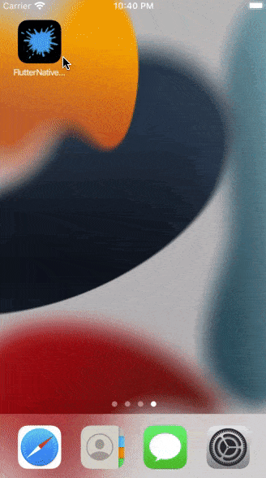

&nbsp;&nbsp;
&nbsp;&nbsp;
<a href="https://choosealicense.com/licenses/mit/" target="_blank"></a>&nbsp;&nbsp;
&nbsp;&nbsp;


# Native Splash & App Icon Generator

</img>

This repo is for teaching us how to implement the "native splash screen" in flutter & also how to generate "app icon" automatically for iOS, Android, & Web platforms.<br>
Detail information of each of the process is given below with application demo screenshots.

## Native Splash Screen

You can follow this [YouTube](https://www.youtube.com/watch?v=dB0dOnc2k10) video to learn about [flutter_native_splash](https://pub.dev/packages/flutter_native_splash) package.<br>
**All the images mush be in .png file format**

```yaml
dependencies:
  flutter:
    sdk: flutter
  # For native splash screen
  flutter_native_splash: ^2.2.7

flutter_native_splash:
  # color: "#f5cb42"
  background_image: assets/splash_screen/background.png
  image: assets/splash_screen/flutter_logo.png
  web: false
```

Now, in terminal:

```shell
$ flutter clean
$ flutter pub get
$ flutter pub run flutter_native_splash:create
```

To remove the splash screen, in terminal, write:

```shell
$ flutter pub run flutter_native_splash:remove
```

## App-Icon Generator Process

You can follow this [YouTube](https://www.youtube.com/watch?v=eMHbgIgJyUQ) video to learn about [flutter_launcher_icons](https://pub.dev/packages/flutter_launcher_icons) package.<br>
In `pubspec.yaml`, copy and pest the following into the **dev_dependencies** section.

```yaml
dev_dependencies:
  flutter_test:
    sdk: flutter
  flutter_lints: ^2.0.1
  # For generating launch icon
  flutter_launcher_icons: ^0.10.0

flutter_icons:
  android: true
  ios: true
  image_path: "assets/app_icon/icon1.png"
  adaptive_icon_background: "#EEEEEE"
  min_sdk_android: 21 # android min sdk min:16, default 21
  web:
    generate: true
    image_path: "assets/app_icon/icon1.png"
    background_color: "#EEEEEE"
    theme_color: "#EEEEEE"
```

Now, in terminal:

```shell
$ flutter pub get
$ flutter pub run flutter_launcher_icons:main
```

## App Demo

<table align="center" style="margin: 0px auto;">
  <tr>
    <th align="center">iOS Simulator</th>
    <th align="center">Physical Android Device</th>
  </tr>
  <tr>
    <td align="center"></img></td>
    <td align="center"></img></td>
  </tr>
</table>
